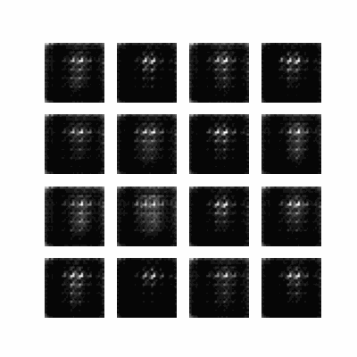

# DCGAN-MNIST-Digit-Image-Generator

This repository implements a **Deep Convolutional Generative Adversarial Network (DCGAN)** to generate realistic handwritten digit images based on the MNIST dataset. The project showcases the power of GANs in image synthesis through a step-by-step pipeline, resulting in high-quality digit generation.

---

## Table of Contents 📑

- [Overview](#overview)
- [Features](#features)
- [Setup and Installation](#setup-and-installation)
- [Training Workflow](#training-workflow)
- [Results](#results)
- [Usage](#usage)
- [Contributing](#contributing)
- [License](#license)

---

## Overview 🖼️

A Generative Adversarial Network (GAN) consists of two neural networks:

- **Generator**: Creates fake images from random noise.
- **Discriminator**: Distinguishes between real images and generated images.

This project uses a **Deep Convolutional GAN (DCGAN)** architecture, optimized for generating 28x28 grayscale handwritten digits inspired by the MNIST dataset. The results are saved and visualized, including an animated GIF of generated images during training.

---

## Features ✨

- Generates realistic handwritten digit images.
- Uses the MNIST dataset for training.
- Includes a training workflow with checkpointing.
- Visualizes training progress through an animated GIF.

---

## Setup and Installation 🛠️

1. Clone the repository:
   ```bash
   git clone https://github.com/yourusername/DCGAN-MNIST-Digit-Image-Generator.git
   cd DCGAN-MNIST-Digit-Image-Generator
   ```

2. Install required dependencies:
   ```bash
   pip install -r requirements.txt
   ```

3. Run the script to start training:
   ```bash
   python generate_hand_written_digit_images_dcgan.py
   ```

---

## Training Workflow 🔄

1. **Data Preparation**: The MNIST dataset is loaded and preprocessed.
2. **Model Creation**: 
   - Generator creates images from random noise using transposed convolutions.
   - Discriminator evaluates whether an image is real or fake.
3. **Loss Definition**:
   - Discriminator loss ensures the model distinguishes real from fake images.
   - Generator loss ensures generated images can fool the discriminator.
4. **Training Loop**:
   - Both models are trained iteratively using a defined training loop.
   - Checkpoints are saved periodically.
5. **Visualization**: An animated GIF, `dcgan.gif`, showcases training progress.

---

## Results 🖼️



This GIF demonstrates the improvement in the quality of generated digit images over 100 training epochs.

---

## Usage 🧰

- Modify the training parameters such as epochs, noise dimension, or batch size in the script for experimentation.
- Use the saved checkpoints to restore and generate images without retraining.

---

## Contributing 🤝

Contributions are welcome! If you have ideas to improve the architecture, code efficiency, or visualization, feel free to create a pull request.

